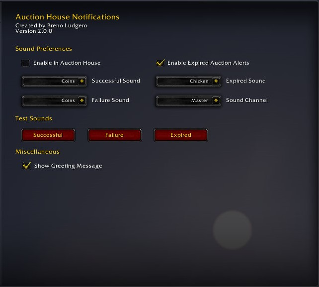

# Auction House Notifications
 

An addOn designed to implement audible alerts to Auction House updates while having minimal impact in hardware resources

## Main Features
* Works with all client languages
* Fully localized options interface
* Option to test sound changes on the fly
* Multiple sound categories to choose from

## Contribute
If you'd like to improve Auction House Notifications by any means, please open an [issue](https://github.com/BrenoLudgero/Auction_House_Notifications/issues "Issues Tab") with a tag related to your improvement (bug fix, feature request, translation, etc..) or leave a comment in one of the two pages linked to the buttons above
